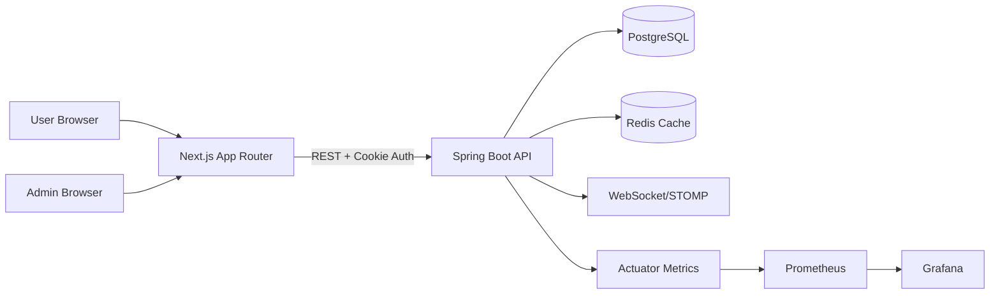

# Smartphone Shop

Smartphone Shop is an e-commerce web application focused on smartphone retail flows.
The project is now API-first with Next.js as the primary UI for both storefront and admin operations.

## Project Overview

This repository demonstrates a full-stack commerce architecture with:

- A Java/Spring backend exposing REST APIs
- A fully migrated Next.js App Router frontend for storefront and admin user journeys
- Redis-backed caching for public product APIs

## Current Status

The codebase has moved to a decoupled frontend/backend model for customer and admin operations.

- Backend migration progress: ~95-100%
- Next.js migration progress (user-journey coverage): ~95-100%
- Thymeleaf customer flows have been decommissioned
- Thymeleaf admin fallback has been decommissioned
- New UI work is developed in `frontend-next/`
- Backend APIs in `backend/` are the primary contract for Next.js

### Delivery Status

- [x] Migration complete for storefront and admin (Next.js-first)
- [x] Test coverage in place for Auth, Product, Order, Admin APIs
- [x] Redis cache integration and cache invalidation flow
- [x] Production hardening baseline
- [x] CI/CD workflow
- [x] Small test gap closed: expanded `CartApi` scenarios + added `CompareService` and `ChatService` tests
- [x] Monitoring dashboard + alerting provisioning
- [x] Portfolio polish baseline (screenshots checklist + project narrative)

## Progress Snapshot (Updated: 2026-04-18)

### Completed recently

- Auth foundation for Next.js:
  - JWT cookie (`httpOnly`) login/logout flow
  - Route guarding via Next.js proxy (`frontend-next/src/proxy.ts`)
- Role-separated navigation hardening:
  - Admin sessions are redirected to `/admin` and blocked from customer route group pages
  - Storefront navigation no longer exposes an `Admin` shortcut for customer sessions
  - Admin header navigation is simplified to `Admin` and `Logout`
  - Storefront products page removed the `Items / page` selector
- New/expanded backend API coverage:
  - `POST /api/v1/orders` for API-first checkout
  - Admin API namespace under `/api/v1/admin` (dashboard, products, orders, chat)
- Catalog performance optimization:
  - Replaced in-memory batch scan/filter flow in `ProductApiController` with DB-side paging/filtering for brand, battery, and screen-size criteria
  - Preserved existing API response contract while removing full-table scan behavior under advanced filters
- Admin dashboard stability fix:
  - Fixed lazy-loading errors on `/api/v1/admin/dashboard` by loading paged orders with items inside transaction scope
- Chat SSE concurrency hardening:
  - Upgraded user emitter registry to `ConcurrentHashMap<String, CopyOnWriteArrayList<SseEmitter>>` to avoid concurrent mutation risks in subscribe/prune/push flows
- JWT production hardening:
  - Added fail-fast startup validation for `prod` profile if JWT secret still uses the default placeholder
  - Kept local `dev/test` startup behavior unchanged
- Architecture debt cleanup:
  - `OrderValidationException` moved to `common/exception`
  - `ChatWebSocketNotifier` moved to `infrastructure/websocket`
  - `StorefrontSupport` moved to `common/support`
- Next.js route migration:
  - `products`, `products/[id]`
  - `login`, `register`
  - `cart`, `checkout`, `profile`, `orders`, `wishlist`, `compare`
  - `admin`, `admin/products`, `admin/orders`, `admin/chat`
- CI setup added:
  - GitHub Actions workflow at `.github/workflows/smartphone-shop-ci.yml`
- Build tooling stabilization:
  - Maven source mapping is now IDE-friendly via `build-helper-maven-plugin`
  - Custom source layout `backend/src/main/java` and `backend/src/test/java` is explicitly registered for Maven/Java Language Server
- Decommission milestone:
  - Removed `controller/user/*` customer MVC controllers
  - Removed `frontend/templates/customer/*`
  - Removed `frontend/static/customer/css` and `frontend/static/customer/js`
  - Kept `frontend/static/customer/images` for shared product assets
  - Removed `controller/admin/*` admin MVC controllers
  - Removed `frontend/templates/admin/*` and `frontend/static/admin/*`
  - Removed `ThymeleafConfig` and `GlobalModelAttributes`
  - Simplified `SecurityConfig` to API-first + static image fallback only
  - Removed `LoginSuccessHandler` (legacy form-login customer bridge)
- Test coverage milestone:
  - Added `OrderApiControllerTest` with business-critical auth and validation scenarios
  - Added `AdminApiControllerTest` for role-based access verification (`ROLE_USER` forbidden, `ROLE_ADMIN` allowed)
  - Expanded `CartApiControllerTest` with edge/error/unauthorized cases
  - Added `CompareServiceTest` and `ChatServiceTest` for service-layer behavior
- Production hardening milestone:
  - Enabled Redis cache integration
  - Added cache for public product catalog/detail endpoints
  - Added cache eviction on admin product mutations
  - Hardened `application-prod.properties` (Flyway validation, metrics exposure, Redis settings, SQL/no-stacktrace defaults)
  - Added optional Prometheus + Grafana stack in `docker-compose` (`monitoring` profile)
  - Added Alertmanager + Prometheus alert rules (API 5xx, p95 latency, cache hit ratio, backend availability)
  - Added Grafana auto-provisioned datasource and dashboard (`Smartphone Shop Overview`)

### Validation status

- Backend test suite: passing (`mvnw test`, re-run after decommission)
- Backend compile: passing (`mvnw -DskipTests compile`, verified after Maven source-mapping update)
- Frontend lint: last known passing
- Frontend build: last known passing

## Core Features

- Product catalog and product detail browsing
- User authentication and profile management
- Cart, wishlist, and compare list workflows
- Checkout and order management
- Payment method selection
- Customer and admin real-time chat support
- Admin dashboard and product/order operations

## Architecture

### Backend (`backend/`)

- Spring Boot application with layered architecture (controller/service/repository)
- Spring Security with JWT support for API authentication
- Spring Data JPA + Hibernate for persistence
- Flyway for schema migration
- WebSocket/STOMP for real-time messaging
- OpenAPI/Swagger for API documentation
- Custom backend source layout wired through Maven build-helper for IDE consistency

### Legacy Assets (`frontend/`)

- Shared product image assets used by backend `/images/**` mapping (`static/customer/images`)
- No active Thymeleaf template runtime

### Modern Frontend (`frontend-next/`)

- Next.js App Router + React + TypeScript
- API-driven rendering for new storefront pages

## Architecture Diagram



## Technology Stack

- Backend: Java 21, Spring Boot 3, Spring Security, JPA/Hibernate
- Database: PostgreSQL
- Frontend: Next.js, React, TypeScript, Tailwind CSS
- Tooling: Maven Wrapper, Docker Compose

## Run Locally

### Option A (recommended scripts)

Windows PowerShell:

```powershell
.\scripts\start-dev-stack.ps1
```

macOS/Linux:

```bash
./scripts/start-dev-stack.sh
```

This boots:

- PostgreSQL + Redis via Docker Compose
- Backend at `http://localhost:8080`
- Next.js frontend at `http://localhost:3000`

### Option B (manual start)

1. Start infrastructure:

```bash
docker compose up -d postgres redis
```

1. Start backend:

```bash
./mvnw spring-boot:run
```

1. Start frontend:

```bash
cd frontend-next
npm install
npm run dev
```

### Environment defaults

- Backend profile defaults to `dev` (`spring.profiles.default=dev`)
- Backend CORS default: `http://localhost:3000`
- Frontend API base example is in `frontend-next/.env.example`
- Dev bootstrap admin account (unless overridden by env vars):
  - Email: `admin@smartphone.local`
  - Password: `Admin@123456`

### Monitoring stack (optional)

Start observability services:

```bash
docker compose --profile monitoring up -d prometheus grafana alertmanager
```

Access points:

- Prometheus: `http://localhost:9090`
- Alertmanager: `http://localhost:9093`
- Grafana: `http://localhost:3001` (`admin` / `admin`)
- Dashboard folder: `Smartphone Shop`
- Dashboard name: `Smartphone Shop Overview`

## Project Structure

```text
smartphone-shop/
├── .github/
│   └── workflows/
│       └── smartphone-shop-ci.yml
├── .mvn/
│   └── wrapper/
│       └── maven-wrapper.properties
├── backend/
│   └── src/
│       ├── main/
│       │   ├── java/
│       │   │   └── io/github/ngtrphuc/smartphone_shop/
│       │   │       ├── api/
│       │   │       │   ├── dto/
│       │   │       │   │   ├── AuthMeResponse.java
│       │   │       │   │   ├── AuthTokenResponse.java
│       │   │       │   │   ├── CartItemResponse.java
│       │   │       │   │   ├── CartResponse.java
│       │   │       │   │   ├── CatalogPageResponse.java
│       │   │       │   │   ├── ChatMessageResponse.java
│       │   │       │   │   ├── CompareResponse.java
│       │   │       │   │   ├── ErrorResponse.java
│       │   │       │   │   ├── OperationStatusResponse.java
│       │   │       │   │   ├── OrderItemResponse.java
│       │   │       │   │   ├── OrderResponse.java
│       │   │       │   │   ├── PaymentMethodResponse.java
│       │   │       │   │   ├── ProductDetailResponse.java
│       │   │       │   │   ├── ProductSummary.java
│       │   │       │   │   ├── ProfileResponse.java
│       │   │       │   │   ├── WishlistItemResponse.java
│       │   │       │   │   └── WishlistResponse.java
│       │   │       │   ├── ApiExceptionHandler.java
│       │   │       │   └── ApiMapper.java
│       │   │       ├── common/exception/
│       │   │       │   ├── BusinessException.java
│       │   │       │   ├── OrderValidationException.java
│       │   │       │   ├── ResourceNotFoundException.java
│       │   │       │   ├── UnauthorizedActionException.java
│       │   │       │   └── ValidationException.java
│       │   │       ├── common/support/
│       │   │       │   └── StorefrontSupport.java
│       │   │       ├── config/
│       │   │       │   ├── AdminAccountInitializer.java
│       │   │       │   ├── DataInitializer.java
│       │   │       │   ├── PaymentMethodSchemaInitializer.java
│       │   │       │   ├── SecurityConfig.java
│       │   │       │   ├── WebConfig.java
│       │   │       │   └── WebSocketConfig.java
│       │   │       ├── controller/
│       │   │       │   └── api/v1/
│       │   │       │   │   ├── AdminApiController.java
│       │   │       │   │   ├── AuthApiController.java
│       │   │       │   │   ├── CartApiController.java
│       │   │       │   │   ├── ChatApiController.java
│       │   │       │   │   ├── CompareApiController.java
│       │   │       │   │   ├── OrderApiController.java
│       │   │       │   │   ├── PaymentMethodApiController.java
│       │   │       │   │   ├── ProductApiController.java
│       │   │       │   │   ├── ProfileApiController.java
│       │   │       │   │   └── WishlistApiController.java
│       │   │       ├── event/
│       │   │       │   └── ChatMessageCreatedEvent.java
│       │   │       ├── model/
│       │   │       │   ├── CartItem.java
│       │   │       │   ├── CartItemEntity.java
│       │   │       │   ├── ChatMessage.java
│       │   │       │   ├── CompareItemEntity.java
│       │   │       │   ├── Order.java
│       │   │       │   ├── OrderItem.java
│       │   │       │   ├── PaymentMethod.java
│       │   │       │   ├── Product.java
│       │   │       │   ├── User.java
│       │   │       │   ├── WishlistItem.java
│       │   │       │   └── WishlistItemEntity.java
│       │   │       ├── repository/
│       │   │       │   ├── CartItemRepository.java
│       │   │       │   ├── ChatMessageRepository.java
│       │   │       │   ├── CompareItemRepository.java
│       │   │       │   ├── OrderRepository.java
│       │   │       │   ├── PaymentMethodRepository.java
│       │   │       │   ├── ProductRepository.java
│       │   │       │   ├── UserRepository.java
│       │   │       │   └── WishlistItemRepository.java
│       │   │       ├── security/
│       │   │       │   ├── JwtAuthenticationFilter.java
│       │   │       │   ├── JwtProperties.java
│       │   │       │   ├── JwtStompChannelInterceptor.java
│       │   │       │   └── JwtTokenProvider.java
│       │   │       ├── service/
│       │   │       │   ├── AuthService.java
│       │   │       │   ├── CartService.java
│       │   │       │   ├── ChatService.java
│       │   │       │   ├── CompareService.java
│       │   │       │   ├── CustomUserDetailsService.java
│       │   │       │   ├── OrderService.java
│       │   │       │   ├── PaymentMethodService.java
│       │   │       │   └── WishlistService.java
│       │   │       ├── infrastructure/websocket/
│       │   │       │   └── ChatWebSocketNotifier.java
│       │   │       ├── DevInfrastructureBootstrap.java
│       │   │       ├── Port8080Guard.java
│       │   │       └── SmartphoneShopApplication.java
│       │   └── resources/
│       │       ├── db/migration/
│       │       │   └── V1__baseline_schema.sql
│       │       ├── application.properties
│       │       ├── application-dev.properties
│       │       └── application-prod.properties
│       └── test/
│           ├── java/io/github/ngtrphuc/smartphone_shop/
│           │   ├── config/
│           │   │   ├── ApplicationPropertiesDefaultProfileTest.java
│           │   │   └── PaymentMethodSchemaInitializerTest.java
│           │   ├── controller/
│           │   │   ├── api/v1/
│           │   │   │   ├── AdminApiControllerTest.java
│           │   │   │   ├── AuthApiControllerTest.java
│           │   │   │   ├── CartApiControllerTest.java
│           │   │   │   ├── OrderApiControllerTest.java
│           │   │   │   └── ProductApiControllerTest.java
│           │   ├── model/
│           │   │   └── PaymentMethodTest.java
│           │   ├── service/
│           │   │   ├── AuthServiceTest.java
│           │   │   ├── CartServiceTest.java
│           │   │   ├── ChatServiceTest.java
│           │   │   ├── CompareServiceTest.java
│           │   │   ├── MockitoNullSafety.java
│           │   │   ├── OrderServiceTest.java
│           │   │   ├── PaymentMethodServiceTest.java
│           │   │   └── WishlistServiceTest.java
│           │   ├── Port8080GuardTest.java
│           │   └── SmartphoneShopApplicationTests.java
│           └── resources/
│               └── application-test.properties
├── frontend/
│   ├── static/
│   │   └── customer/
│   │   │   └── images/ (shared product assets)
│   └── templates/
│       └── (templates removed)
├── frontend-next/
│   ├── public/ (SVG/image assets)
│   ├── src/
│   │   ├── app/
│   │   │   ├── (auth)/
│   │   │   │   ├── layout.tsx
│   │   │   │   ├── login/page.tsx
│   │   │   │   └── register/page.tsx
│   │   │   ├── (storefront)/
│   │   │   │   ├── layout.tsx
│   │   │   │   ├── products/
│   │   │   │   │   ├── [id]/page.tsx
│   │   │   │   │   └── page.tsx
│   │   │   │   ├── cart/page.tsx
│   │   │   │   ├── checkout/page.tsx
│   │   │   │   ├── profile/page.tsx
│   │   │   │   ├── orders/page.tsx
│   │   │   │   ├── wishlist/page.tsx
│   │   │   │   └── compare/page.tsx
│   │   │   ├── admin/
│   │   │   │   ├── layout.tsx
│   │   │   │   ├── page.tsx
│   │   │   │   ├── products/page.tsx
│   │   │   │   ├── orders/page.tsx
│   │   │   │   └── chat/page.tsx
│   │   │   ├── globals.css
│   │   │   ├── layout.tsx
│   │   │   └── page.tsx
│   │   ├── components/storefront/
│   │   │   ├── product-actions.tsx
│   │   │   └── product-card.tsx
│   │   └── lib/
│   │       ├── api.ts
│   │       └── format.ts
│   ├── src/proxy.ts
│   ├── .env.example
│   ├── .gitignore
│   ├── AGENTS.md
│   ├── CLAUDE.md
│   ├── eslint.config.mjs
│   ├── next-env.d.ts
│   ├── next.config.ts
│   ├── package-lock.json
│   ├── package.json
│   ├── postcss.config.mjs
│   ├── README.md
│   └── tsconfig.json
├── scripts/
│   ├── start-dev-infra.ps1
│   ├── start-dev-stack.ps1
│   └── start-dev-stack.sh
├── docs/
│   ├── portfolio.md
│   └── screenshots/
│       └── README.md
├── monitoring/
│   ├── alerts/
│   │   └── smartphone-shop-alerts.yml
│   ├── alertmanager/
│   │   └── alertmanager.yml
│   ├── grafana/
│   │   └── provisioning/
│   │       ├── dashboards/
│   │       │   ├── dashboard.yml
│   │       │   └── json/smartphone-shop-overview.json
│   │       └── datasources/prometheus.yml
│   └── prometheus.yml
├── .editorconfig
├── .gitattributes
├── .gitignore
├── docker-compose.yml
├── mvnw
├── mvnw.cmd
├── pom.xml
└── README.md
```

## Quality and Validation

- Backend tests are located under `backend/src/test`
- Frontend quality checks (lint/build) are managed inside `frontend-next/`
- Latest local validation snapshot:
  - `mvnw test`: passing
  - `npm run lint`: passing (1 non-blocking hook warning)
  - `npm run build`: passing

## Design Decisions

- API-first migration over full rewrite:
  - Reduced delivery risk while keeping backend business logic stable.
  - Allowed incremental rollout of Next.js without blocking feature work.
- `httpOnly` JWT cookie auth:
  - Better XSS resistance than storing tokens in browser-managed storage.
  - Works well with server-side and route-guarded flows in Next.js.
- Keep legacy customer assets only (`frontend/static/customer/images`):
  - Preserves product image compatibility for backend `/images/**` mapping.
  - Removes template/CSS/JS debt while avoiding asset migration churn.
- Cache only public product reads:
  - Prevents user-specific response leakage (e.g., wishlist context).
  - Use explicit cache eviction on admin product writes.

## Portfolio Guide

- Technical narrative: `docs/portfolio.md`
- Screenshot checklist: `docs/screenshots/README.md`
- Monitoring dashboard: `monitoring/grafana/provisioning/dashboards/json/smartphone-shop-overview.json`
- Alert rules: `monitoring/alerts/smartphone-shop-alerts.yml`

## Optional Next Iterations

1. Add E2E checkout/admin flows (Playwright) for full regression confidence.
1. Add Grafana contact points and notification channels (Slack/Email) for real alert delivery.
1. Add deployment automation docs for a cloud target (Render/Fly.io/Azure/GCP).
