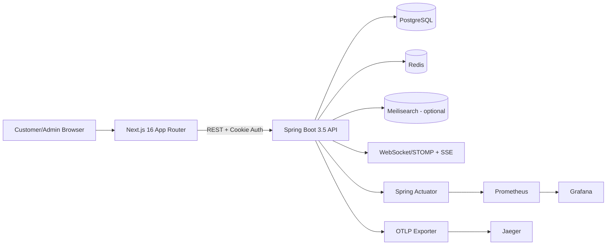

# Smartphone Shop

A full-stack smartphone e-commerce platform built with an API-first backend
and a Next.js App Router frontend.

This README documents the project architecture, major feature sets,
technologies, and refactor progress. It also includes a detailed repository
inventory at file level.

## Table of Contents

- [Project Overview](#project-overview)
- [Feature Set](#feature-set)
- [System Architecture](#system-architecture)
- [Technology Stack](#technology-stack)
- [API Domain Map](#api-domain-map)
- [Local Development](#local-development)
- [Environment Configuration](#environment-configuration)
- [Refactor Progress](#refactor-progress)
- [Recent UI Updates](#recent-ui-updates)
- [Recent Backend/API Updates](#recent-backendapi-updates)
- [Testing and Quality](#testing-and-quality)
- [Repository Structure (Detailed)](#repository-structure-detailed)
- [Contributor Notes](#contributor-notes)

## Project Overview

Smartphone Shop models a production-oriented commerce workflow:

- Browse catalog and product detail pages.
- Manage cart, wishlist, and compare slots.
- Complete checkout with full payment or installment plans.
- Track order lifecycle and customer/admin chat.
- Operate an admin area for dashboard, products, and orders.

## Feature Set

### Storefront Features

- Authentication with JWT in httpOnly cookies.
- Email verification flow with token-based confirmation and resend support.
- Product catalog with search, filter, sorting, and pagination.
- Product detail pages with quick actions.
- Cart and checkout flow.
- Profile and payment methods.
- Address book management (multi-address with default selection).
- Order lifecycle tracking, cancellation, and return/refund requests.
- Wishlist and compare.
- Customer support chat.
- Storefront footer with role-aware quick links and social login shortcuts.

### Admin Features

- Dashboard overview.
- Product management.
- Order management with lifecycle status updates and tracking handoff.
- Chat conversation management.

### Cross-Cutting Features

- Login and API rate limiting.
- Enum-based user roles and account status guardrails.
- Checkout idempotency.
- Caching for catalog/detail with user-specific overlays.
- Optional Meilisearch with database fallback.
- Metrics, tracing, dashboards, and alerting.

## System Architecture



## Technology Stack

### Backend Stack

- Java 21.
- Spring Boot 3.5.14.
- Spring Web, Validation, Security, Data JPA, Data Redis, WebSocket,
  and Actuator.
- Flyway migrations.
- Caffeine + Redis cache.
- JWT via `jjwt` 0.12.6.
- OpenAPI via `springdoc-openapi-starter-webmvc-ui`.
- Micrometer + Prometheus registry + OpenTelemetry bridge/exporter.

### Frontend Stack

- Next.js 16.2.4 (App Router).
- React 19.2.4.
- TypeScript 5.x.
- Tailwind CSS 4.
- Playwright E2E.

### Data and Infrastructure

- PostgreSQL 16.
- Redis 7.
- Meilisearch 1.13.
- Docker Compose for local orchestration.

### Tooling and CI

- Maven Wrapper.
- ESLint for `frontend-next`.
- GitHub Actions workflow in
  `.github/workflows/smartphone-shop-ci.yml`.

## API Domain Map

### Customer APIs (`/api/v1/**`)

- Auth.
- Catalog and product detail.
- Cart.
- Checkout and orders (customer order history is paginated).
- Profile and payment methods.
- Address book.
- Wishlist.
- Compare.
- Chat (REST + SSE).

#### Notable Customer API Contracts

- `GET /api/v1/orders?page={page}&pageSize={pageSize}`
  returns a page envelope:
  `orders`, `currentPage`, `totalPages`, `totalElements`, `pageSize`.
- `POST /api/v1/orders` validates payload at API boundary
  (`@Valid`) before service execution.
- `POST /api/v1/auth/verify-email?token={token}` verifies email ownership.
- `POST /api/v1/auth/resend-verification` resends verification email for
  authenticated users.
- `PUT /api/v1/addresses/{id}/default` atomically clears old default and sets
  new default address.

### Admin APIs (`/api/v1/admin/**`)

- Dashboard.
- Products.
- Orders.
- Chat.

### API Docs

- Swagger UI: `<http://localhost:8080/swagger-ui/index.html>`.

## Local Development

### Prerequisites

- Java 21.
- Node.js 20+.
- Docker and Docker Compose.

### Recommended One-Command Start

Windows PowerShell:

```powershell
./scripts/start-dev-stack.ps1
```

macOS/Linux:

```bash
./scripts/start-dev-stack.sh
```

### Manual Start

- Start infrastructure:

```bash
docker compose up -d postgres redis meilisearch
```

Note: local Redis now requires a password via `REDIS_PASSWORD`
(default in `docker-compose.yml` is `smartphone-redis-dev` for local use).

- Run backend:

```bash
./mvnw spring-boot:run
```

- Run frontend:

```bash
cd frontend-next
npm install
npm run dev
```

### Default Endpoints

- Frontend: `<http://localhost:3000>`.
- Backend: `<http://localhost:8080>`.
- Swagger UI: `<http://localhost:8080/swagger-ui/index.html>`.
- Health: `<http://localhost:8080/actuator/health>`.

## Environment Configuration

### Backend Profiles

- Local default: `dev`.
- Production: `SPRING_PROFILES_ACTIVE=prod`.

### Important Backend Variables

- `JWT_SECRET`, `JWT_ACCESS_TOKEN_MINUTES`.
- `APP_CORS_ALLOWED_ORIGINS`.
- `APP_REQUIRE_EMAIL_VERIFICATION`, `APP_AUTH_VERIFICATION_LINK_BASE_URL`.
- `APP_SEARCH_MEILI_ENABLED`, `APP_SEARCH_MEILI_HOST`,
  `APP_SEARCH_MEILI_API_KEY`.
- `DATASOURCE_URL`, `DATASOURCE_USER`, `DATASOURCE_PASSWORD`.
- `REDIS_HOST`, `REDIS_PORT`, `REDIS_PASSWORD`.
- `ADMIN_EMAIL`, `ADMIN_PASSWORD`.
- `APP_EMAIL_PROVIDER`, `APP_EMAIL_FROM`.
- `SMTP_HOST`, `SMTP_PORT`, `SMTP_USERNAME`, `SMTP_PASSWORD`.

### Frontend Variables

- `NEXT_PUBLIC_API_BASE_URL` (or compatible API base env wired in
  `frontend-next/src/lib/api.ts`).

## Refactor Progress

### Backend API-First Standardization

Status: stable baseline completed.

- Modularized service/repository/controller layers.
- Security filter chain with JWT and rate limits.
- Idempotent checkout flow and order workflow processing.
- Cache strategy for catalog/product detail.

### Frontend Migration to Next.js

Status: core user journeys completed and actively iterated.

- Storefront routes migrated under App Router.
- Admin routes available in Next.js.
- Shared UI components and storefront modules consolidated.

### Legacy Frontend Footprint

Status: retained for asset compatibility.

- `frontend/static` remains as a shared/legacy asset source for product,
  payment, and icon assets consumed by the backend and Next.js asset proxy.
- Runtime emphasis is on `frontend-next` for active UI.

## Recent UI Updates

Latest storefront UI refinements in `frontend-next`:

- Motion system refresh for smoother page and card transitions using
  transform/opacity-first animations.
- Motion timing/easing calibration for smoother perceived movement:
  softer card flips, reduced abrupt hover lifts, and synchronized
  JS/CSS transition windows for catalog pagination.
- App Router page-level transitions via route templates for
  `(storefront)` and `admin`.
- Vertical pagination rail for product catalog on desktop:
  - sticky positioning (summary-like behavior, not floating drift),
  - up/down arrow navigation,
  - active page stays stable on hover,
  - non-active buttons use invert + pop hover states.
- Footer redesign:
  - English copy and updated hotline format: `+81 XXXX XXXX`,
  - role-aware quick links:
    - guest: product + compare links,
    - authenticated customer: adds cart + orders,
    - authenticated admin: admin panel link (no customer cart/orders),
  - SNS icon buttons (Facebook, Instagram, X, LINE, TikTok, YouTube)
    with hover tooltip labels and external login links.

### Observability and Operations

Status: production-like local baseline available.

- Prometheus, Grafana, and Alertmanager profile in Docker Compose.
- Jaeger tracing path enabled via OTLP.

## Recent Backend/API Updates

- Commercial product model rollout:
  - category/brand entities,
  - product variants + SKU support,
  - multi-image and dynamic product specs.
- User model upgrade:
  - `UserRole` enum and `AccountStatus`,
  - email verification fields and token workflow,
  - address book module with default-address management.
- Order lifecycle upgrade:
  - enum-based order state transitions,
  - tracking fields and shipped/delivered/completed timestamps,
  - return/refund states and moderation flow.
- Email provider upgrade:
  - expanded `EmailSender` contract for verify/welcome/order/status emails,
  - pluggable provider mode (`log` for dev, `smtp` for production),
  - async status-change notifications via event listener.
- New customer address APIs:
  - list/create/update/delete/set-default under `/api/v1/addresses`.
- New return and shipping APIs:
  - customer `POST /api/v1/orders/{id}/return`,
  - admin ship endpoint and return approve/reject/refund endpoints under
    `/api/v1/admin/orders/{id}/...`.
- Auth APIs extended:
  - verify email and resend verification endpoints.
- Runtime `payment_methods` schema patching at app startup was removed.
  Flyway is now the single schema owner (see
  `V9__payment_method_schema_runtime_migration_retirement.sql`).
- Product catalog query parameters are now bound through
  `CatalogFilterRequest` (`@ModelAttribute`) for cleaner controller contracts.
- Security hardening updates:
  - CORS request headers are explicitly whitelisted (no wildcard `*`).
  - JWT provider emits a warning when non-prod runs with default secret.
- Redis hardening updates:
  - `docker-compose.yml` starts Redis with `--requirepass`.
  - Spring config now reads `REDIS_PASSWORD` in base/dev/prod profiles.
- `OrderApiController` now keeps transaction ownership in service layer
  (controller-level `@Transactional` removed from checkout endpoint).
- API-level request validation added for checkout and profile update payloads.
- `ApiExceptionHandler` now handles `MethodArgumentNotValidException`
  with standardized `VALIDATION_FAILED` responses.
- Profile business logic extracted to dedicated `ProfileService`.
- Shared validation utility added:
  `common/support/ValidationConstants.java`.

## Testing and Quality

### Backend Test Commands

```bash
./mvnw test
./mvnw -DskipTests compile
```

### Frontend Test Commands

```bash
cd frontend-next
npm run lint
npm run build
npm run test:e2e
```

## Repository Structure (Detailed)

The tree below is file-level for code/config files.
For image and SVG assets, it intentionally shows only the folder level.

- Scope includes current workspace files.
- Excludes generated/runtime directories: `.next`, `node_modules`, `target`,
  `.data`.
- Excludes local ephemeral files: `.env.local`, Playwright last-run cache.

<!-- markdownlint-disable MD013 -->

```text
smartphone-shop/
├── .github/
│   ├── java-upgrade/
│   │   ├── hooks/
│   │   │   └── scripts/
│   │   │       ├── recordToolUse.ps1
│   │   │       └── recordToolUse.sh
│   │   └── .gitignore
│   └── workflows/
│       └── smartphone-shop-ci.yml
├── .mvn/
│   └── wrapper/
│       └── maven-wrapper.properties
├── .vscode/
│   ├── launch.json
│   └── tasks.json
├── backend/
│   └── src/
│       ├── main/
│       │   ├── java/
│       │   │   └── io/
│       │   │       └── github/
│       │   │           └── ngtrphuc/
│       │   │               └── smartphone_shop/
│       │   │                   ├── api/
│       │   │                   │   ├── dto/
│       │   │                   │   │   ├── AddressResponse.java
│       │   │                   │   │   ├── AuthMeResponse.java
│       │   │                   │   │   ├── AuthTokenResponse.java
│       │   │                   │   │   ├── CartItemResponse.java
│       │   │                   │   │   ├── CartResponse.java
│       │   │                   │   │   ├── CatalogFilterRequest.java
│       │   │                   │   │   ├── CatalogPageResponse.java
│       │   │                   │   │   ├── ChatMessageResponse.java
│       │   │                   │   │   ├── CompareResponse.java
│       │   │                   │   │   ├── ErrorResponse.java
│       │   │                   │   │   ├── OperationStatusResponse.java
│       │   │                   │   │   ├── OrderItemResponse.java
│       │   │                   │   │   ├── OrderResponse.java
│       │   │                   │   │   ├── PaymentMethodResponse.java
│       │   │                   │   │   ├── ProductDetailResponse.java
│       │   │                   │   │   ├── ProductImageResponse.java
│       │   │                   │   │   ├── ProductSpecResponse.java
│       │   │                   │   │   ├── ProductSummary.java
│       │   │                   │   │   ├── ProductVariantResponse.java
│       │   │                   │   │   ├── ProfileResponse.java
│       │   │                   │   │   ├── WishlistItemResponse.java
│       │   │                   │   │   └── WishlistResponse.java
│       │   │                   │   ├── ApiExceptionHandler.java
│       │   │                   │   └── ApiMapper.java
│       │   │                   ├── common/
│       │   │                   │   ├── exception/
│       │   │                   │   │   ├── BusinessException.java
│       │   │                   │   │   ├── OrderValidationException.java
│       │   │                   │   │   ├── ResourceNotFoundException.java
│       │   │                   │   │   ├── UnauthorizedActionException.java
│       │   │                   │   │   └── ValidationException.java
│       │   │                   │   └── support/
│       │   │                   │       ├── AssetUrlResolver.java
│       │   │                   │       ├── CacheKeys.java
│       │   │                   │       ├── StorefrontSupport.java
│       │   │                   │       └── ValidationConstants.java
│       │   │                   ├── config/
│       │   │                   │   ├── AdminAccountInitializer.java
│       │   │                   │   ├── AsyncExecutionConfig.java
│       │   │                   │   ├── DataInitializer.java
│       │   │                   │   ├── PaymentSimulationProperties.java
│       │   │                   │   ├── ProductSearchProperties.java
│       │   │                   │   ├── SecurityConfig.java
│       │   │                   │   ├── WebConfig.java
│       │   │                   │   └── WebSocketConfig.java
│       │   │                   ├── controller/
│       │   │                   │   ├── api/
│       │   │                   │   │   └── v1/
│       │   │                   │   │       ├── AddressApiController.java
│       │   │                   │   │       ├── AdminChatApiController.java
│       │   │                   │   │       ├── AdminDashboardApiController.java
│       │   │                   │   │       ├── AdminOrderApiController.java
│       │   │                   │   │       ├── AdminProductApiController.java
│       │   │                   │   │       ├── AuthApiController.java
│       │   │                   │   │       ├── CartApiController.java
│       │   │                   │   │       ├── ChatApiController.java
│       │   │                   │   │       ├── CompareApiController.java
│       │   │                   │   │       ├── OrderApiController.java
│       │   │                   │   │       ├── PaymentMethodApiController.java
│       │   │                   │   │       ├── ProductApiController.java
│       │   │                   │   │       ├── ProfileApiController.java
│       │   │                   │   │       └── WishlistApiController.java
│       │   │                   │   └── RootController.java
│       │   │                   ├── event/
│       │   │                   │   ├── ChatMessageCreatedEvent.java
│       │   │                   │   ├── OrderCreatedEvent.java
│       │   │                   │   └── OrderStatusChangedEvent.java
│       │   │                   ├── infrastructure/
│       │   │                   │   └── websocket/
│       │   │                   │       └── ChatWebSocketNotifier.java
│       │   │                   ├── model/
│       │   │                   │   ├── AccountStatus.java
│       │   │                   │   ├── Address.java
│       │   │                   │   ├── Brand.java
│       │   │                   │   ├── CartItem.java
│       │   │                   │   ├── CartItemEntity.java
│       │   │                   │   ├── Category.java
│       │   │                   │   ├── ChatMessage.java
│       │   │                   │   ├── CompareItemEntity.java
│       │   │                   │   ├── EmailVerificationToken.java
│       │   │                   │   ├── Order.java
│       │   │                   │   ├── OrderReturn.java
│       │   │                   │   ├── OrderIdempotencyKey.java
│       │   │                   │   ├── OrderItem.java
│       │   │                   │   ├── OrderStatus.java
│       │   │                   │   ├── PaymentMethod.java
│       │   │                   │   ├── Product.java
│       │   │                   │   ├── ProductImage.java
│       │   │                   │   ├── ProductSpec.java
│       │   │                   │   ├── ProductVariant.java
│       │   │                   │   ├── User.java
│       │   │                   │   ├── UserRole.java
│       │   │                   │   ├── WishlistItem.java
│       │   │                   │   └── WishlistItemEntity.java
│       │   │                   ├── repository/
│       │   │                   │   ├── spec/
│       │   │                   │   │   └── ProductCatalogSpecifications.java
│       │   │                   │   ├── AddressRepository.java
│       │   │                   │   ├── BrandRepository.java
│       │   │                   │   ├── CartItemRepository.java
│       │   │                   │   ├── CategoryRepository.java
│       │   │                   │   ├── ChatMessageRepository.java
│       │   │                   │   ├── CompareItemRepository.java
│       │   │                   │   ├── EmailVerificationTokenRepository.java
│       │   │                   │   ├── OrderIdempotencyKeyRepository.java
│       │   │                   │   ├── OrderRepository.java
│       │   │                   │   ├── OrderReturnRepository.java
│       │   │                   │   ├── PaymentMethodRepository.java
│       │   │                   │   ├── ProductImageRepository.java
│       │   │                   │   ├── ProductRepository.java
│       │   │                   │   ├── ProductSpecRepository.java
│       │   │                   │   ├── ProductVariantRepository.java
│       │   │                   │   ├── UserRepository.java
│       │   │                   │   └── WishlistItemRepository.java
│       │   │                   ├── security/
│       │   │                   │   ├── ApiRateLimitFilter.java
│       │   │                   │   ├── ClientIpResolver.java
│       │   │                   │   ├── JwtAuthenticationFilter.java
│       │   │                   │   ├── JwtProperties.java
│       │   │                   │   ├── JwtStompChannelInterceptor.java
│       │   │                   │   ├── JwtTokenProvider.java
│       │   │                   │   └── LoginRateLimitFilter.java
│       │   │                   ├── service/
│       │   │                   │   ├── AddressService.java
│       │   │                   │   ├── AuthService.java
│       │   │                   │   ├── CartService.java
│       │   │                   │   ├── ChatService.java
│       │   │                   │   ├── ChatSseRegistry.java
│       │   │                   │   ├── CompareService.java
│       │   │                   │   ├── CustomUserDetailsService.java
│       │   │                   │   ├── EmailSender.java
│       │   │                   │   ├── EmailVerificationService.java
│       │   │                   │   ├── LogOnlyEmailSender.java
│       │   │                   │   ├── OrderIdempotencyService.java
│       │   │                   │   ├── OrderReturnService.java
│       │   │                   │   ├── OrderService.java
│       │   │                   │   ├── OrderWorkflowProcessor.java
│       │   │                   │   ├── PaymentMethodService.java
│       │   │                   │   ├── ProductCommerceService.java
│       │   │                   │   ├── ProfileService.java
│       │   │                   │   ├── ProductSearchService.java
│       │   │                   │   ├── SimulatedPaymentGateway.java
│       │   │                   │   ├── SmtpEmailSender.java
│       │   │                   │   └── WishlistService.java
│       │   │                   ├── DevFrontendBootstrap.java
│       │   │                   ├── DevInfrastructureBootstrap.java
│       │   │                   ├── Port8080Guard.java
│       │   │                   └── SmartphoneShopApplication.java
│       │   └── resources/
│       │       ├── db/
│       │       │   └── migration/
│       │       │       ├── V1__baseline_schema.sql
│       │       │       ├── V2__performance_indexes.sql
│       │       │       ├── V3__idempotency_and_recommendation_indexes.sql
│       │       │       ├── V4__stale_placeholder_cleanup.sql
│       │       │       ├── V5__commercial_product_model.sql
│       │       │       ├── V6__user_role_and_address_book.sql
│       │       │       ├── V7__email_verification.sql
│       │       │       ├── V8__order_lifecycle_and_returns.sql
│       │       │       └── V9__payment_method_schema_runtime_migration_retirement.sql
│       │       ├── application.properties
│       │       ├── application-dev.properties
│       │       └── application-prod.properties
│       └── test/
│           ├── java/
│           │   └── io/
│           │       └── github/
│           │           └── ngtrphuc/
│           │               └── smartphone_shop/
│           │                   ├── common/
│           │                   │   └── support/
│           │                   │       ├── AssetUrlResolverTest.java
│           │                   │       └── CacheKeysTest.java
│           │                   ├── config/
│           │                   │   ├── ApplicationPropertiesDefaultProfileTest.java
│           │                   │   ├── DataInitializerTest.java
│           │                   ├── controller/
│           │                   │   ├── api/
│           │                   │   │   └── v1/
│           │                   │   │       ├── AdminApiControllerTest.java
│           │                   │   │       ├── AuthApiControllerTest.java
│           │                   │   │       ├── CartApiControllerTest.java
│           │                   │   │       ├── CompareApiControllerTest.java
│           │                   │   │       ├── OrderApiControllerTest.java
│           │                   │   │       └── ProductApiControllerTest.java
│           │                   │   └── RootControllerTest.java
│           │                   ├── model/
│           │                   │   └── PaymentMethodTest.java
│           │                   ├── repository/
│           │                   │   └── ProductCatalogSpecificationIntegrationTest.java
│           │                   ├── security/
│           │                   │   ├── ApiRateLimitFilterTest.java
│           │                   │   ├── JwtTokenProviderTest.java
│           │                   │   └── LoginRateLimitFilterTest.java
│           │                   ├── service/
│           │                   │   ├── AuthServiceTest.java
│           │                   │   ├── CartServiceTest.java
│           │                   │   ├── ChatServiceTest.java
│           │                   │   ├── CompareServiceTest.java
│           │                   │   ├── MockitoNullSafety.java
│           │                   │   ├── OrderIdempotencyServiceTest.java
│           │                   │   ├── OrderServiceTest.java
│           │                   │   ├── OrderWorkflowProcessorTest.java
│           │                   │   ├── PaymentMethodServiceTest.java
│           │                   │   ├── SimulatedPaymentGatewayTest.java
│           │                   │   └── WishlistServiceTest.java
│           │                   ├── DevFrontendBootstrapTest.java
│           │                   ├── Port8080GuardTest.java
│           │                   └── SmartphoneShopApplicationTests.java
│           └── resources/
│               └── application-test.properties
├── docs/
│   ├── screenshots/
│   │   └── README.md
│   └── portfolio.md
├── frontend/
│   └── static/
│       ├── customer/
│       │   └── images/
│       └── svg/
│           └── griddy/
│               └── README.md
├── frontend-next/
│   ├── public/
│   │   ├── griddy/
│   │   ├── payments/
│   │   ├── sns/
│   │   ├── file.svg
│   │   ├── globe.svg
│   │   ├── next.svg
│   │   ├── vercel.svg
│   │   └── window.svg
│   ├── src/
│   │   ├── app/
│   │   │   ├── (auth)/
│   │   │   │   ├── login/
│   │   │   │   │   └── page.tsx
│   │   │   │   ├── register/
│   │   │   │   │   └── page.tsx
│   │   │   │   └── layout.tsx
│   │   │   ├── (storefront)/
│   │   │   │   ├── cart/
│   │   │   │   │   └── page.tsx
│   │   │   │   ├── chat/
│   │   │   │   │   └── page.tsx
│   │   │   │   ├── checkout/
│   │   │   │   │   ├── success/
│   │   │   │   │   │   └── page.tsx
│   │   │   │   │   ├── loading.tsx
│   │   │   │   │   └── page.tsx
│   │   │   │   ├── compare/
│   │   │   │   │   └── page.tsx
│   │   │   │   ├── orders/
│   │   │   │   │   └── page.tsx
│   │   │   │   ├── products/
│   │   │   │   │   ├── [id]/
│   │   │   │   │   │   ├── loading.tsx
│   │   │   │   │   │   ├── not-found.tsx
│   │   │   │   │   │   └── page.tsx
│   │   │   │   │   ├── error.tsx
│   │   │   │   │   ├── loading.tsx
│   │   │   │   │   └── page.tsx
│   │   │   │   ├── profile/
│   │   │   │   │   └── page.tsx
│   │   │   │   ├── wishlist/
│   │   │   │   │   └── page.tsx
│   │   │   │   ├── layout.tsx
│   │   │   │   └── template.tsx
│   │   │   ├── admin/
│   │   │   │   ├── chat/
│   │   │   │   │   └── page.tsx
│   │   │   │   ├── orders/
│   │   │   │   │   └── page.tsx
│   │   │   │   ├── products/
│   │   │   │   │   └── page.tsx
│   │   │   │   ├── layout.tsx
│   │   │   │   ├── page.tsx
│   │   │   │   └── template.tsx
│   │   │   ├── asset-proxy/
│   │   │   │   └── [...path]/
│   │   │   │       └── route.ts
│   │   │   ├── favicon.ico
│   │   │   ├── globals.css
│   │   │   ├── layout.tsx
│   │   │   └── page.tsx
│   │   ├── components/
│   │   │   ├── admin/
│   │   │   │   ├── admin-header-nav.tsx
│   │   │   │   └── admin-session-actions.tsx
│   │   │   ├── auth/
│   │   │   │   └── password-field.tsx
│   │   │   ├── storefront/
│   │   │   │   ├── catalog-filters.tsx
│   │   │   │   ├── catalog-paged-grid.tsx
│   │   │   │   ├── catalog-viewport-sync.tsx
│   │   │   │   ├── checkout-skeleton.tsx
│   │   │   │   ├── filter-dropdown.tsx
│   │   │   │   ├── payment-method-badge.tsx
│   │   │   │   ├── product-actions.tsx
│   │   │   │   ├── product-card.tsx
│   │   │   │   ├── product-detail-skeleton.tsx
│   │   │   │   ├── product-grid-skeleton.tsx
│   │   │   │   ├── quick-product-actions.tsx
│   │   │   │   ├── storefront-chat-bubble.tsx
│   │   │   │   ├── storefront-compare-banner.tsx
│   │   │   │   ├── storefront-footer.tsx
│   │   │   │   └── storefront-header-dock-nav.tsx
│   │   │   └── ui/
│   │   │       ├── auth-motion-icon.tsx
│   │   │       ├── dock.tsx
│   │   │       ├── expanding-nav.tsx
│   │   │       ├── griddy-icon.tsx
│   │   │       ├── skeleton.tsx
│   │   │       └── vercel-tabs.tsx
│   │   ├── lib/
│   │   │   ├── api.ts
│   │   │   ├── format.ts
│   │   │   └── order-status.ts
│   │   └── proxy.ts
│   ├── tests/
│   │   ├── auth.spec.ts
│   │   └── checkout.spec.ts
│   ├── .env.example
│   ├── .gitignore
│   ├── AGENTS.md
│   ├── CLAUDE.md
│   ├── eslint.config.mjs
│   ├── next.config.ts
│   ├── next-env.d.ts
│   ├── package.json
│   ├── package-lock.json
│   ├── playwright.config.ts
│   ├── postcss.config.mjs
│   ├── README.md
│   └── tsconfig.json
├── monitoring/
│   ├── alertmanager/
│   │   └── alertmanager.yml
│   ├── alerts/
│   │   └── smartphone-shop-alerts.yml
│   ├── grafana/
│   │   └── provisioning/
│   │       ├── dashboards/
│   │       │   ├── json/
│   │       │   │   └── smartphone-shop-overview.json
│   │       │   └── dashboard.yml
│   │       └── datasources/
│   │           └── prometheus.yml
│   └── prometheus.yml
├── scripts/
│   ├── start-dev-infra.ps1
│   ├── start-dev-stack.ps1
│   ├── start-dev-stack.sh
│   └── start-frontend-dev.ps1
├── .editorconfig
├── .gitattributes
├── .gitignore
├── docker-compose.yml
├── mvnw
├── mvnw.cmd
├── pom.xml
└── README.md
```

<!-- markdownlint-enable MD013 -->

## Contributor Notes

- Follow `.editorconfig` conventions.
- Do not commit secrets or local-only credentials.
- Prefer service-layer business logic over controller-level shortcuts.
- Keep API contracts backward compatible unless intentionally versioned.
